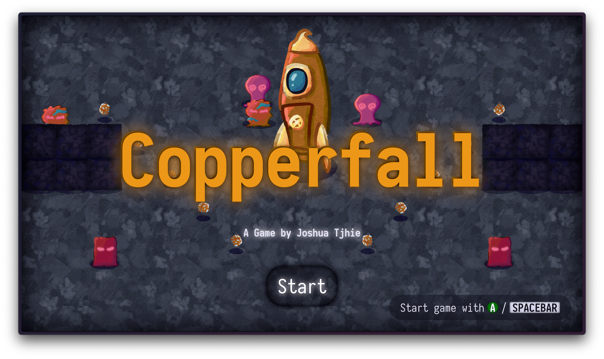
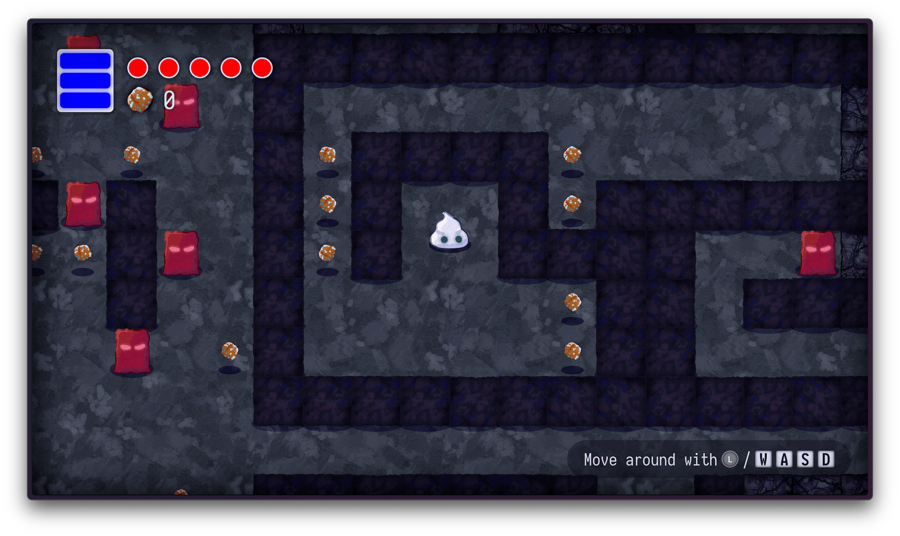
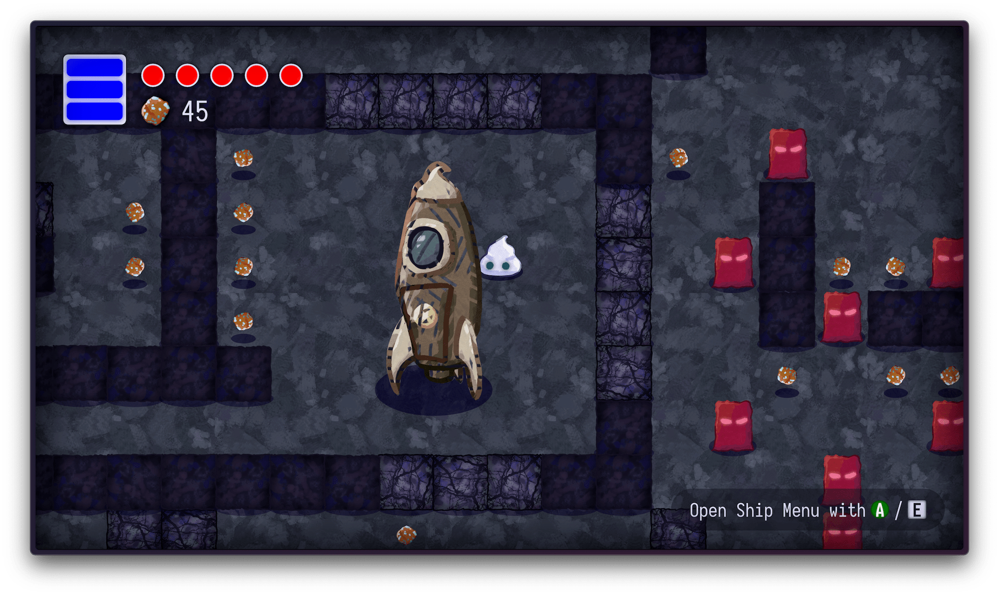
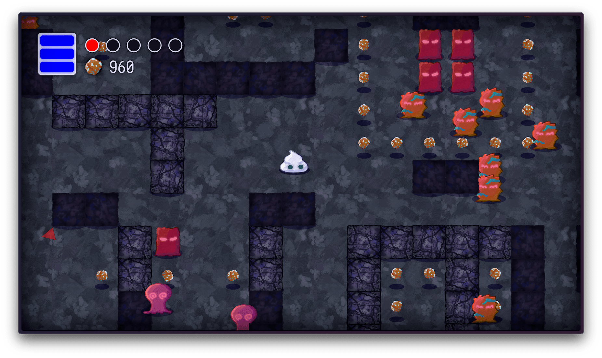
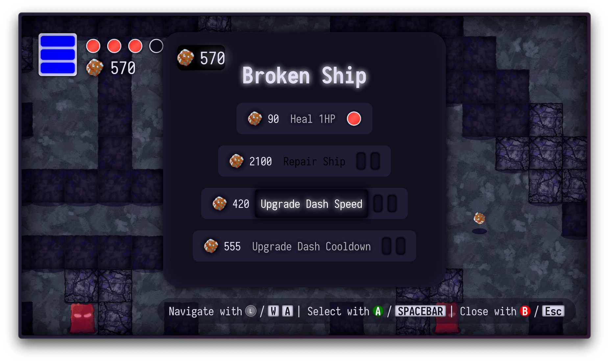

# copperfall


[Play Copperfall](https://chifunt.com/copperfall/)
---
**Copperfall** is a custom 2D JavaScript/Canvas game engine and game project made for the first semester project of Creative Computing @ St. Pölten University of Applied Sciences, featuring:

- A **custom game loop** (`Engine.js`) with scenes, game objects, and components (Inspired by Unity).  
- An **entity-component system** to easily add and remove behaviors (colliders, sprite rendering, etc.).  
- A **collision system** for both triggers (e.g. pick-up zones) and physics-like collisions (e.g. rocks).  
- **Input handling** that supports keyboard and gamepad, plus event-based “actions” (e.g., “dash,” “interact”).  
- A flexible **UI** system using HTML/CSS menus, tooltips, and event-driven transitions.  
- A **chunk-based “world”** generator that loads map data from small 8×8 pixel images, spawns GameObjects accordingly, and splices them into the main scene on demand.

---

### Directory Overview

```plaintext
.
├── assets/               # Images, audio, fonts, and screenshots
├── css/                  # Stylesheets (style.css)
├── js/
│   ├── components/       # Reusable components for GameObjects
│   ├── core/             # Engine classes: Engine, GameObject, Scene, etc.
│   ├── gameobjects/      # Specific GameObject subclasses (Player, Enemies, Rock...)
│   │   └── chunks/       # Chunk-based generation logic (BaseChunk, StarterChunk, etc.)
│   ├── scenes/           # Scene definitions (MainMenuScene, MainScene, etc.)
│   └── utils/            # Helper modules (SoundManager, EasingFunctions, etc.)
├── index.html            # The main HTML entry point
├── README.md             # Project summary & usage instructions
└── ... (other files)
```

#### Key Files & Folders

1. **`js/core/Engine.js`**  
   - The main engine, handling:
     - Game loop / requestAnimationFrame  
     - Loading/destroying Scenes  
     - Maintaining a list of active GameObjects  
     - Camera position & scale  

2. **`js/core/GameObject.js`**  
   - Base class for all objects.  
   - Has a `Transform` and a list of `Components`.

3. **`js/components`**  
   - Each file is a `Component` that can be attached to a `GameObject`:  
     - **`SpriteRenderer`** (draws images)  
     - **`BoxCollider`, `CircleCollider`**, etc.  
     - **`Rigidbody`** (simple physics flags)  
     - **`ScreenShake`**, **`SquashAndStretch`**, etc.

4. **`js/gameobjects`**  
   - Prebuilt specialized `GameObject`s (e.g. `Player.js`, `Rock.js`, `Spaceship.js`, `EnemyFast.js`, etc.).  
   - **`InputHandler.js`**: Singleton that polls keyboard and gamepad, emits action events.  
   - **`UIManager.js` & `ToolTipManager.js`**: Show/hide UI overlays (menus, tooltips).  
   - **`ChunkManager.js`** & **`chunks/`**: Generates the world in “chunks” and loads objects from small PNG map “blueprints.”

5. **`js/scenes`**  
   - Scenes like **`MainMenuScene`** or **`MainScene`** define which objects get created, their arrangement, etc.

6. **`js/utils`**  
   - **`SoundManager.js`** with `SoundEffects.js` for playing audio clips.  
   - **`EasingFunctions.js`**: standard easing formulas for animations.  
   - **`Actions.js`**: enumerates game-wide action names (e.g. `DASH`, `INTERACT`).

---

### Running / Building

1. **Open `index.html` in a browser** (serve via an HTTP server) to run locally.  
2. No special build steps are required; the `.js` files are ES modules imported in `main.js`.  

(Use a local dev server, browsers typically disable some js features for security reasons otherwise.)

---

### Screenshots




(I think gifs would be better here but I'll do that later)
